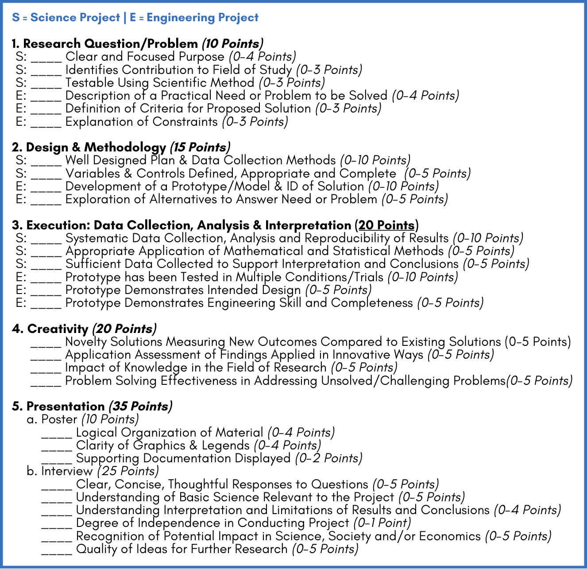

# Science Fair Documentation

Hi! I'm going to be documenting some science fair information here. It is not directly relevant to the development otherwise, but it's good to include with the project.

## Risk Assessment

1. Identify and assess the risks and hazards involved in this project.

Since the only equipment I will be using is a regular personal computer, which is generally considered to be safe under normal circumstances, I don't face much physical risk. However, there is the legal danger of using copyrighted code when researching for solutions online, and also the digital danger of malware when using the internet for research purposes. Finally, there is a legal risk when collecting analytics on my website.

2. 
	a. List all hazardous chemicals, activities or devices to be used
	
	No chemicals will be used. The only device used is a regular personal computer, which is not considered hazardous. The activities being performed on the computer are not considered hazardous, as they are pretty normal and regular activities such as researching, coding, etc.
	
	b. identify and list all microorganisms to be used that are exempt from pre-approval (see Potentially Hazardous Biological Agent rules).
	
	No microorganisms will be used. I mean, there is the risk of computer viruses, and precautions will be taken to stay safe from them, but I'm pretty sure that's not what this section is about.

3. Describe the safety precautions and procedures that will be used to reduce the risks. If you conducted field work, include permits received and safety plans, as applicable.

To avoid potential copyright issues, I will adapt any code used as necessary to make it my own. To avoid digital danger, I will also avoid suspicious websites and links while researching, and I will have an antivirus installed to limit damage if malware does somehow run. I will also ensure that my analytics platform is privacy-respecting and legally compliant in order to avoid any legality issues when collecting data.

4. Describe the specific disposal procedures that will be used (when applicable).

Disposal procedures are not applicable here.

5. List the source(s) of safety information.

I'll be honest, most of the safety information here is just general computer safety, so here are some links to accompany and support the information above.
Considerations when copy-pasting code: https://www.mend.io/blog/copy-and-paste-code/
General computer safety: https://usa.kaspersky.com/resource-center/preemptive-safety/top-10-internet-safety-rules-and-what-not-to-do-online

## Research Plan/Project Summary

Rationale: a brief synopsis of the background that supports your research problem and explain why this research is important and if applicable, explain any societal impact of your research

> I am making a useful, feature-filled website that will be accessible to the public. There are many stages of software engineering that I will go through, such as designing a user interface (UI), prioritizing features that matter, and actually coding the website so that it is usable, efficient, and looks nice. Each part requires research in order to do it well. Researching what UI choices work well helps better users' experience. Researching alternatives clarifies what are important features to prioritize. And since no developer knows it all off the top of their head, researching during development is absolutely critical to get efficient and working code written. The product of all this research is well-written code that others can find (open source) and benefit from when writing their own programs.

### RESEARCH QUESTION

Includes hypothesis(es), expected outcomes, and engineering goals. How are they based on the rationale above?

Hypothesis

> HYPOTHESIS: Limiting the flexibility of choosing what schedule to follow, while increasing the ease of use and feature list, will result in a better user experience than the previous method of allowing free reign over schedule creation and lacking ease of use.
> 
> In last year's project, the School Schedule Clock (SSC), users could define their own schedules, period by period, day by day. My new project, TimeCheck 22 (TC22), only allows you to pick your school. However, this limitation enables the app to provide much more useful information like detailed daily schedules, anomalous schedule days (like rallies), and just more context. This distinction aligns with the above rationale, because research can aid me to find the best balance of limitation (between no control and full control) by observing other solutions and common user needs in this space.

Expected Outcomes

> PREDICTION: If students are limited to selecting their school, and not given the full schedule creation capabilities, then they will find the app more usable and even more useful than before.
> 
> I expect students who use my new project, TimeCheck 22 (TC22), to find it easier to use/understand and more useful overall, because it will feature less complexity while giving them more value. In SSC, the user wrote their own schedules, and TC22 simplifies that by giving predefined schedules by school, which will hopefully increase the number of users who find it useful and therefore continue using it.

Engineering Goal

> The engineering goal is to create an app that fulfills the purpose, scope, and constraints outlined in the Software Requirements Specification (SRS) document while achieveing the needs described by the user requirements. The SRS can be found in the code documentation files, but in short, the goal is "to enable students & teachers to easily and effectively use the customizable clock to track the time as it passes during school". Further details are provided in the SRS, including the requirements, which are the tasks to be done to meet completion.

### PROCEDURES

Detail all procedures and experimental design including methods for data collection, and when applicable, the source of data used.

Experimental Design

> First, I wrote the Software Requirements Specification (SRS) document, which details the objectives of the project. Based off of those goals and constraints, I wrote user stories, which are real life examples of what various users/stakeholders actually want. Then, I prioritize those user stories and work on the most important ones first, going on until all of them are done. This design flow ensures I'm spending my time working on what matters most to the stakeholders, and not on side features that don't really matter. This continues until the final product is something all users are happy with.

Methods for Data Collection

> To collect data, I will use Umami, which is a data analytics platform. It can be thought of like Google Analytics, except it is much more privacy-respecting, doesn't sell the analytics data to the highest bidder, and is compliant with many standards like the GDPR. The method for actually collecting data is simply adding a tag inside my website's code, which will run the analytics code when the site loads. This records how many visits I get, which pages were visited, and how long they stayed.

Source of Data

> As mentioned before, the source of the data is Umami. The Umami analytics snippet runs when the users load TimeCheck 22 into their web browser, and it reports back useful analytics data that helps me see whether users were actually engaged with the website or just looked and left. I can view this data in the Umami analytics dashboard or export it locally for analysis. This data is anonymous/non-identifiable.

### RISK AND SAFETY

Potential Risk

> Since the only equipment I will be using is a regular personal computer, which is generally considered to be safe under normal circumstances, I don't face much physical risk. However, there is the legal danger of using copyrighted code when researching for solutions online, and also the digital danger of malware when using the internet for research purposes. Finally, there is a legal risk when collecting analytics on my website. I face no risk from hazardous chemicals, activities, devices, or microorganisms (the hazardous agents mentioned in Form 3, "Risk Assessment"), since I don't deal with any of those in my project.

Safety Precautions

> To avoid potential copyright issues, I will adapt any code used as necessary to make it my own. To avoid digital danger, I will also avoid suspicious websites and links while researching, and I will have an antivirus installed to limit damage if malware does somehow run. I will also ensure that my analytics platform is privacy-respecting and legally compliant in order to avoid any legality issues when collecting data.

### DATA ANALYSIS

Describe the procedures you will use to analyze the results.

> I will use the filters provided in the Umami analytics dashboard to compare how the website is performing over time, and this data can be compared with assumptions on how SSC is performing. I didn't add analytics to SSC, so it's hard to know how well it's doing, but I did get a sense of how people liked it. The data analysis will see if the reactions to TC22 are better than that of SSC, and if the usage analytics match the image the visible reactions produced, i.e. do people use TC22 if they seem to be excited about the idea of it? Since the data is already nicely provided and formatted, I will not need to do much data transformation for analyzing it.

Bibliography

> Most of the content written here is based on what I know. However, here are some links to back up what I say. 
> Stack Overflow, a common place to find answers to coding problems (research rationale section): https://stackoverflow.com/ 
> General computer safety (risk and safety sections): https://www.lifewire.com/computer-safety-tips-153314 
> Umami privacy features, scroll down to Privacy (data analysis section): https://umami.is/features

## Judging Criteria

Mine is an engineering/software project, so I will answer those here.

1. Research Question/Problem

Description of a practical need or problem to be solved (4 pts)

> My school, Chino Hills High School, has late starts on Monday and regular schedule on Tuesday to Friday. I know many students and even teachers who don't exactly remember the Monday schedule, even though we have it every week. This problem only gets worse on special days like rallies, where a unique rally schedule is followed, or block schedule days. These days have unique schedules that barely anyone knows, and most of my teachers end up writing the schedule on their board if they have the schedule. The rally schedule is the same every rally, but no reasonable person would remember every special schedule that the school has, period by period. That's the problem TimeCheck 22 solves - given the effort of a few dedicated students, everyone can benefit as the schedule is easily available on the TC22 website. The website also includes useful information like how much time is left in the period, how much time has passed, and a full listing of all schedules the school has. This way, people can check in on the schedule ahead of time.
> 
> Now, you might think, isn't this already solved with things like the announcement bell? Like, the one that rings on time every time? Well, I was surprised to learn this, but the bell apparently rings on days off, and I've also personally seen some times when it rings when it shouldn't. For example, it's on regular schedule when we're on block schedule. I know - my website was actually more accurate than the schedule our own school bell is on! What about posters around the school that have the bell schedule on them? Those don't contain every schedule, and they don't adapt to show you that one unique schedule you'll only see twice a year (for example, finals block schedules). TimeCheck 22 solves a unique need, and by doing this, enables students and teachers alike to be more efficient with their time, since they have a good idea when the period ends and how much time is left. Chino Hills High School itself has over 2700 students and 140 teachers, and when many of them are confused about how much time we have left in class, that results in a huge loss of potentially productive time and is generally a bother. I really don't like it when I don't know how much time is left, because it helps me pace myself.

Definition of Criteria for a Proposed Solution (3 pts)

> I wrote a Software Requirements Specification (SRS) document that outlines the purpose, audience, scope, stakeholders, constraints, and requirements. The criteria I specified was that the website should meet the needs of 4 main groups: 1. regular students, 2. regular teachers, 3. school managers, and 4. me, the administrator. To do this, it should make it easy to select their school, view schedules, see how much time passed/is left, be customizable, and have extra useful features. If a solution has all these features, it meets the criteria. These criteria are based on last year's project and my hypothesis, which guesses that reducing complexity by limiting choice while simultaneously increasing usefulness is better. That's why the main requirement went from being able to write your own schedule to only being able to select your school.

Explanation of Constraints (3 pts)

> Some constraints that I added in the SRS are that it should work on screens of all usual sizes, like a phone, a Chromebook, and a ViewSonic; it should be quick to load; and it should work offline. These constraints were actually written to allow my website to be experienceable by more people, so it is more useful in all form factors - on the go with your phone, during class with your Chromebook, and for teachers, on the ViewSonic. These constraints are all on top of the criteria mentioned before, where it needs all of its basic functional requirements.

2. Design & Methodology

Development of a Prototype/Model & ID of Solution (10 pts)

> The prototype is available as a website online at <https://timecheck22.lraj22.xyz/>. The code is available on GitHub at <https://github.com/lraj22/timecheck22>, and anyone can go through the entirety of the history of coding it through the commit history also available in the GitHub repository. The solution identified is the one in the hypothesis - limiting choice to reduce complexity and increase usefulness. I developed this solution by defining the requirements, designing the user interface in Figma, and prototyping it by writing code, testing, rewriting, testing, over and over again until all the initally set requirements were met. At that point, the prototype was complete.

Exploration of Alternatives to Answer Need or Problem (5 pts)

> There are two existing alternatives: the PA bell and schedule posters. The PA bell is okay, but it doesn't tell you WHEN the period ends, it only lets you know that it has ended, which isn't helpful for students and teachers trying to plan their time well. Additionally, it isn't the most accurate. One of my teachers told me it rang on off days, and I've experienced it ring on the wrong bell schedule (regular instead of block). Schedule posters are also okay, but they don't include unique schedules like rally schedule, and those that do don't contain even more niche schedules like finals block schedules or others. They're static and therefore you must do the math yourself to figure out how much time is left. There exists no other solution that adapts to daily schedule variations like TimeCheck 22 does, because nothing else can possibly be as aware of the real situation.

3. Execution: Data Collection, Analysis & Interpretation (20 pts)

Prototype has been Tested in Multiple Conditions/Trials (10 pts)

> I have tested it in all of the following conditions: mobile website, mobile app, desktop website, large desktop website, ViewSonic (TV size), online/offline. Those are the constraints defined in the Software Requirements Specification (SRS) that I had to write code for. For my prototype, "trials" doesn't really apply, because no matter how many times you try an action, it'll have the same result - it's just about what whether that result is satisfactory or not (i.e., does it work or not work). From my testing, everything works in all form factors.

Prototype Demonstrates Intended Design (5 pts)

> The SRS indicates that the prototype should "enable students & teachers to easily and effectively use the customizable clock to track the time as it passes during school", and it should work "during school, in class/passing between classes on a Chromebook, phone, personal computer, or ViewSonic". It should enable the user to select their school, see how much time passed/remains in the class period, be customizable, and have extra features. These requirements are all met by my prototype.

Prototype Demonstrates Engineering Skill and Completeness (5 pts)

> The commit history can be viewed in [the GitHub repository][repo]. I'll explain the workings and show the code to demonstrate engineering skill, and completeness can be determined based on how well it solves the problem and how well it meets the requirements outlined in the SRS. It's up to the judges to interpret this, but given that I actually used engineering skill, and actually completed the product, I think I should be fine 😭

4. Creativity

Novelty Solutions Measuring New Outcomes Compared to Existing Solutions (5 pts)

> x

Application Assessment of Findings Applied in Innovative Ways (5 pts)

> x

Impact of Knowledge in the Field of Research (5 pts)

> x

Problem Solving Effectiveness in Addressing Unsolved/Challenging Problems(5 pts)

> x

5. Presentation (35 pts)

This section is entirely based on what I put on my backboard and how well I do my interview, so I won't write anything here. If you're interested in what the target points are, I'll put them below.

a. Poster

Logical Organization of Material (4 pts) 
Clarity of Graphics & Legends (4 pts) 
Supporting Documentation Displayed (2 pts)

b. Interview

Clear, Concise, Thoughtful Responses to Questions (5 pts) 
Understanding of Basic Science Relevant to the Project (5 pts) 
Understanding Interpretation and Limitations of Results and Conclusions (4 pts) 
Degree of Independence in Conducting Project (1 pt) 
Recognition of Potential Impact in Science, Society and/or Economics (5 pts) 
Quality of Ideas for Further Research (5 pts)

[repo]: https://github.com/lraj22/timecheck22
